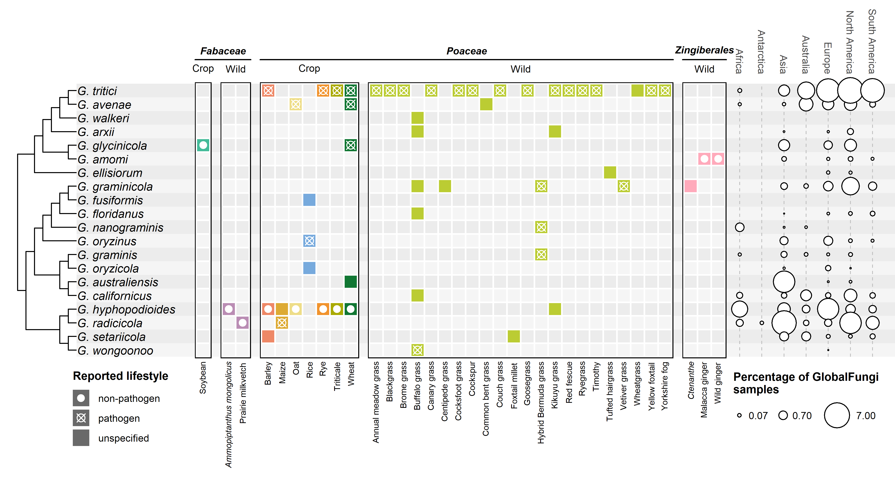

# *Gaeumannomyces* Data Synthesis

Bioinformatics workflow for:
> Hill (2025) Host range and global distribution of *Gaeumannomyces* root fungi of cereal crops and wild grasses. in prep

The workflow was written for and run on Norwich BioScience Institutes' HPC cluster which uses the SLURM batch-queue system. This means that many of the bash scripts (`.sh` file endings) specify core allocation, run times and memory usage allocation that may need to be adapted for different platforms.

Input sequence data was sourced from the [GlobalFungi](https://globalfungi.com/) database, release 5.0, downloaded on 27/02/2024.

---

## Phylogenetic reclassification

1. `sbatch 01_align.sh` makes alignments using [MAFFT](https://github.com/GSLBiotech/mafft) for genes listed in the file `markers`. These are manually checked using [Aliview](https://github.com/AliView/AliView), and manually trimmed in the case of protein-coding genes.
2. `sbatch 02_trim.sh` performs automated trimming of select genes using [trimAl](https://github.com/inab/trimal), and replace terminal gaps with `?` in all alignments.
3. `sbatch 03_concat.sh` concatenates all gene alignments into supermatrix using [AMAS](https://github.com/marekborowiec/AMAS).
4. `sbatch 04_raxmlng_speciestree.sh` builds ML species tree using [RAxML-NG](https://github.com/amkozlov/raxml-ng) with bootstrapping until convergence or up to 1,000 replicates (whichever first).
5. `Rscript root_tree.R` roots the species tree with the outgroup, and `sbatch 05_epa-ng.sh` then adds the GlobalFungi sequences to the ITS alignment using MAFFT and runs [EPA-ng](https://github.com/pierrebarbera/epa-ng) to place the sequences in the reference tree.
6. `sbatch 06_raxmlng_its.sh` build ML gene trees using RAxML-NG for ITS and its two subregions ITS1 and ITS2 separately.

## Data visualisation

All subsequent analysis and data visualisation is described in `plot_Gaeumannomyces_data_synthesis.R`, using GlobalFungi and manually compiled metadata in the `data` folder. Due to its size, `GF5_allsamples.csv` from GlobalFungi is not located in `data`, but can be downloaded directly from the [website](https://globalfungi.com/).
